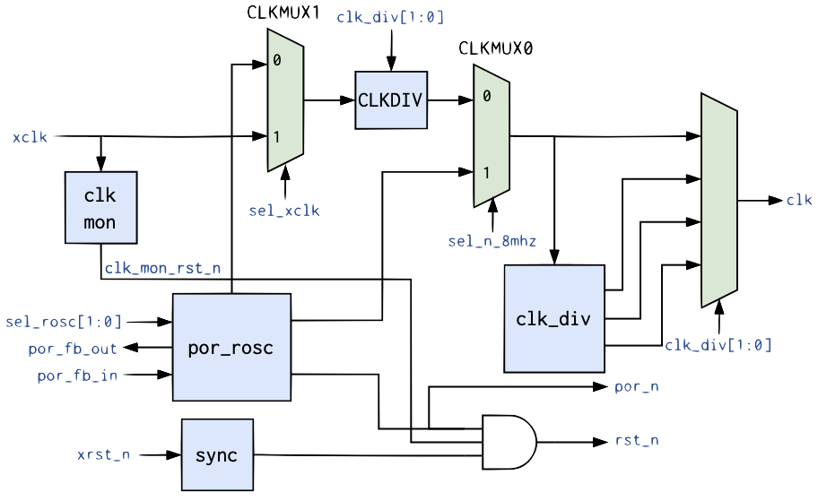

# MS_CLK_RST
All digital Clock and Reset Manager

## Features
- PoR Generation (all digital)
- Internal RC Oscillator (8mhz, 16mhz, 32mhz, 64mhz and 128mhz)
- Clock Multiplexing
- Clock divider (/2, /4 and /8)
- External Clock Monitor (fail-safe to rosc_8mhz)

## Design
### Block Diagram

### Interfaces
## Diagram

## Ports

| Port name  | Direction | Type       | Description |
| ---------- | --------- | ---------- | ----------- |
| xclk       | input     | wire       | External Clock            |
| xrst_n     | input     | wire       | External Reset            |
| sel_n_8mhz | input     | wire       | CLKMUX0 selection - 0:select ROSC 8MHz, 1:select CLMUX1 clock|
| sel_xclk   | input     | wire       | CLKMUX1 selection - 0:ROSC; 1:xclk |
| sel_rosc   | input     | wire [1:0] | ROSC Frequency: 00:128mh, 01:64mhz, 10:32mhz, 11:16mhz            |
| clk_div    | input     | wire [1:0] | Clock divider for the output of CLKMUX1: 1, 2, 4 and 8            |
| por_fb_in  | input     | wire       | must be connected to por_fb_in externally            |
| por_fb_out | output    | wire       | must be connected to por_fb_out externally            |
| clk        | output    | wire       | system clock            |
| rst_n      | output    | wire       | system reset           |
| por_n      | output    | wire       | Power-on-Reset            |

